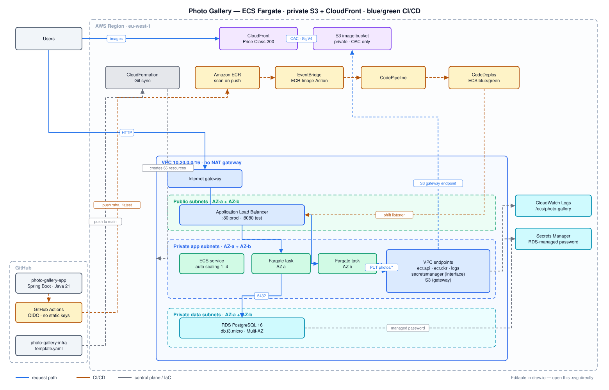

# photo-gallery-infra

The whole system in one CloudFormation template, deployed by **CloudFormation Git
sync**. Push to `main`, and CloudFormation creates and executes a change set.
There is no packaging step, no S3 template bucket and no CI job in the deploy
path — Git sync reads `template.yaml` straight from this repository.



## Layout

| Path | Purpose |
|---|---|
| `template.yaml` | Everything: OIDC + ECR, VPC, S3 + CloudFront, RDS, ECS, CodeDeploy pipeline |
| `.cfn-deployments/main.yaml` | Git sync deployment file: all parameters, all tags |
| `prereq-roles.yaml` | The one role the stack cannot create for itself. Deployed once, by CLI |
| `check-roles.sh` | Verifies every role's permissions against IAM's own evaluator |
| `architecture.drawio.svg` | The diagram above — viewable as an image, editable in draw.io |
| `.github/workflows/lint.yml` | `cfn-lint` on pull requests. Deploys nothing, has no AWS access |

That's the repository. Seven files.

## The diagram

`architecture.drawio.svg` is a real SVG *and* a draw.io document. The draw.io XML
lives in the file's `content` attribute, so the same file both renders here and
opens as a fully editable diagram — no separate source, no export step, nothing
to keep in sync.

To edit it:

- **draw.io desktop / [app.diagrams.net](https://app.diagrams.net)** — *File → Open*,
  pick the `.svg`. Save writes both the picture and the embedded XML back.
- **VS Code** — the *Draw.io Integration* extension opens it on click.

When saving from draw.io, keep the format as **Editable SVG** (draw.io calls it
"SVG" with *Include a copy of my diagram* ticked). Saving as a plain SVG drops the
embedded XML and the file stops being editable.

To hand in a PNG instead, *File → Export as → PNG* from the same file.

## Why one template and not nested stacks

| | This system |
|---|---|
| Resources | 66 (CloudFormation allows 500) |
| Template size | ~49 KB (limit 1 MB) |

Nested stacks solve problems this system does not have. What they *would* have
cost here is concrete: children must be uploaded to S3 before the root stack can
reference them, and Git sync only ever reads the repository — so you need a
bucket to hold them, a bootstrap stack to create that bucket, a CI role to upload
them, and some mechanism to tell Git sync that a child changed (a `TemplateURL`
that never changes produces an empty change set). Every one of those is machinery
in service of the deploy mechanism rather than the system being deployed.

Revisit this if the template approaches ~300 resources, or if a layer develops a
genuinely separate lifecycle or owner. Neither is true today.

Readability is handled with numbered section banners inside `template.yaml`:

```
1. CI identity and container registry
2. Network
3. Image storage and delivery
4. Database
5. Compute
6. Deployment pipeline
```

## Two-stage deployment

A Fargate service cannot reach a steady state until an image exists in ECR, and
this template is what creates the ECR repository and the role that pushes to it.
So `DeployStage` gates the eleven resources that depend on a running service:

| `DeployStage` | What exists |
|---|---|
| `foundation` | Everything else — including the ALB, target groups, listeners, cluster, IAM roles and the task definition |
| `full` | Adds the ECS service, auto scaling, CodeDeploy, CodePipeline and the EventBridge rule |

Only the *service* needs an image. A task definition registers happily against an
image that does not exist yet — ECS does not resolve it until a task launches —
which is why stage `foundation` still brings up almost the entire runtime
environment and gives you a working ALB DNS name.

## IAM roles

Eight roles, in two classes. The split is a chicken-and-egg problem, not a
style choice: CloudFormation needs a role in order to create resources, so the
role that lets it build this stack cannot be built by this stack.

**Created before the stack** — once, and then left alone:

| Role | Created by | Purpose |
|---|---|---|
| `photo-gallery-cfn-execution` | `prereq-roles.yaml`, by CLI | What CloudFormation assumes to build all 66 resources |
| the Git sync role | the CloudFormation console | Reads the repo through the connection, drives change sets |

**Created by `template.yaml`** — six runtime roles, each scoped to one job:

| Role | Assumed by | Can do |
|---|---|---|
| `photo-gallery-github-actions` | the app repo, via OIDC | Push to this ECR repo; write `deploy/*` in the artifact bucket. Nothing else — it cannot deploy |
| `photo-gallery-task` | the container | `s3:PutObject` under `photos/*`. Cannot read objects back, list the bucket, or reach any other bucket |
| `photo-gallery-task-execution` | the ECS agent | Pull the image, read the DB secret, write logs |
| `photo-gallery-codepipeline` | CodePipeline | Read the artifact bucket, register task definitions, drive CodeDeploy |
| `photo-gallery-codedeploy` | CodeDeploy | Shift ALB listeners, manage task sets |
| `photo-gallery-eventbridge-pipeline` | EventBridge | Start this one pipeline |

### Pinning the application repository's OIDC subject

`photo-gallery-github-actions` is the only role assumed from outside AWS, so its
trust policy is the security boundary of the whole CI path. It is pinned to one
repository **and** one branch — never a wildcard:

```
token.actions.githubusercontent.com:aud  =  sts.amazonaws.com
token.actions.githubusercontent.com:sub  =  <prefix>:ref:refs/heads/<AppRepoBranch>
```

The prefix depends on how your GitHub account issues subject claims:

| Form | Subject prefix | Set `AppRepoSubjectPrefix` |
|---|---|---|
| classic | `repo:owner/photo-gallery-app` | leave empty |
| immutable | `repo:owner@211486075/photo-gallery-app@1358941347` | to that exact string |

Immutable claims embed the numeric owner and repository IDs so the trust survives
a rename. If your account issues them, the classic form is **never** sent and a
template that builds it produces a role nobody can assume — the failure surfaces
as a generic "not authorized to perform sts:AssumeRoleWithWebIdentity" in the app
workflow, long after the stack deployed successfully.

The IDs are per repository. Derive the app repo's prefix, and prove the command
is right by first reproducing a value GitHub has already shown you:

```bash
gh api /repos/<owner>/photo-gallery-app \
  --jq '"repo:\(.owner.login)@\(.owner.id)/\(.name)@\(.id)"'
```

Only one form is permitted at a time, deliberately. Allowing the classic form
alongside the immutable one would defeat the point — it would still match a
repository that later took over this one's name.

Deleting and recreating the app repository changes its ID, so the prefix must be
updated. Renaming it does not.

### Why the Git sync role is not in `prereq-roles.yaml`

Its trust policy names an AWS service principal for the sync service, and that
is service-owned detail which changes as the feature evolves. Hard-coding a
guess produces a role that fails in a confusing way. Use **Create new role** in
the sync configuration wizard — the console generates the current, correct
policy — and let `check-roles.sh` verify what it made.

### Verifying the permissions

```bash
chmod +x check-roles.sh
./check-roles.sh
```

It does not read the policy documents and reason about them. It calls
`iam:SimulatePrincipalPolicy`, the same evaluator that authorises the real API
calls, so conditions and resource scoping are genuinely applied.

It checks both directions, which is the part that matters. Anyone can grant
permissions until things work; the negative assertions are what keep it honest:

```
   PASS  allow   s3:PutObject      ...images/photos/new.jpg
   PASS  deny    s3:GetObject      ...images/photos/new.jpg
   PASS  deny    s3:ListBucket     ...images
   PASS  deny    iam:PassRole      ...role/some-unrelated-admin-role
```

Roles that do not exist yet report `SKIP`, so it is safe to run at any stage —
after `prereq-roles.yaml`, after `foundation`, or after `full`. It exits
non-zero if anything is missing or over-permissive.

## Deployment order

0. **Once per account** — create the deployment role:

   ```bash
   aws cloudformation deploy \
     --template-file prereq-roles.yaml \
     --stack-name photo-gallery-prereq \
     --capabilities CAPABILITY_NAMED_IAM

   ./check-roles.sh          # confirms it before you depend on it
   ```

1. In `.cfn-deployments/main.yaml` set `GitHubOrg`, the `Owner` tag, and
   `AppRepoSubjectPrefix` if your account issues immutable claims. Push — Git
   sync reads GitHub, not your working copy.
2. Create one Git sync configuration:

   | Field | Value |
   |---|---|
   | Stack name | `photo-gallery` — exactly; the deployment role's trust policy pins `aws:SourceArn` to it |
   | Deployment file path | `.cfn-deployments/main.yaml` |
   | Git sync IAM role | *Create new role* |
   | IAM role for CloudFormation | `photo-gallery-cfn-execution` |

   It deploys with `DeployStage: foundation` — 55 of the 66 resources, 15–20
   minutes, most of it RDS Multi-AZ and the CloudFront distribution.

3. Put the stack's `GitHubActionsRoleArn` and `ArtifactBucketName` outputs into
   the **app** repository as the `AWS_ROLE_ARN` and `ARTIFACT_BUCKET` variables,
   then push that repo to build the first image.
4. Change `DeployStage: full` in the deployment file, push.
5. `./check-roles.sh` again — all eight roles now exist.

Step 3 has to follow step 2: the role does not exist until the stack builds it.

Everything must be in **one region** — the stack, the ECR repository and the app
workflow's `AWS_REGION`. IAM is global, but the deployment role's trust condition
names the region inside the stack ARN.

From then on there is nothing to remember: edit the template, push, watch the
change set.

## One constraint worth knowing

After the first CodeDeploy deployment, **do not change any property of the
`Service` resource**. CloudFormation includes `taskDefinition` in every
`UpdateService` call and ECS rejects that for CODE_DEPLOY services:

> Unable to update task definition on services with a CODE_DEPLOY deployment controller.

Task definition contents, target groups and auto scaling are separate resources
and remain safe to edit. Two details make that work, both deliberate:
`TaskDefinition: !Ref ProjectName` on the service (a bare family name is a
constant, so task definition edits never provoke a service update) and
`UpdateReplacePolicy: Retain` on the task definition (so the revision CodeDeploy
is running never goes INACTIVE and breaks scale-out).

To change the service anyway: set `DeployStage: foundation`, push, then set it
back to `full`.

## Validate locally

```bash
pip install cfn-lint
cfn-lint -- template.yaml prereq-roles.yaml
```

The same lint runs on every pull request via `.github/workflows/lint.yml`, which
holds no AWS credentials — it checks the template and stops. Nothing in this
repository can deploy; only CloudFormation Git sync can.
